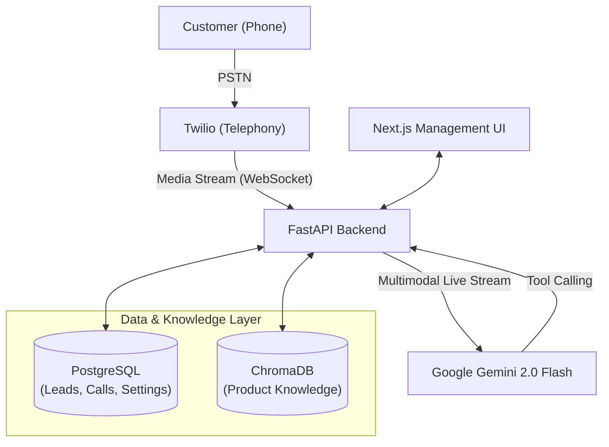

# Design Document: Rio CRM AI Voice Assistant

## 1. Project Overview
**Rio CRM** is an end-to-end AI-powered communication and management platform. It combines a natural language voice interface with a robust CRM dashboard, enabling businesses to automate customer interactions while maintaining high-quality service and data integrity.

### 1.1 Objectives
- **Automate Inbound/Outbound Calls**: Use AI to handle routine inquiries and sales follow-ups.
- **Ultra-Low Latency**: Achieve sub-second response times for natural "human-like" conversation.
- **Data Synchronization**: Automatically log call outcomes, notes, and lead status changes into a centralized database.
- **Agentic Capability**: Enable the AI to perform actions (check inventory, book appointments) via tool-calling.

---

## 2. System Architecture

The following diagram illustrates the high-level architecture and communication flow between components.

### 2.1 Component Breakdown
- **Frontend (Next.js 15)**: A management dashboard for viewing call history, lead management, and assistant configuration.
- **Backend (FastAPI)**: The central orchestrator handling WebSockets, business logic, and database interactions.
- **Voice Intelligence (Gemini Multimodal Live)**: Processes raw audio data and generates natural speech directly, eliminating the delay of traditional Speech-to-Text pipelines.
- **Telephony (Twilio)**: Manages phone numbers, signaling, and real-time audio streaming.
- **Persistence (PostgreSQL + SQLAlchemy)**: Stores structured lead data and system configurations.
- **RAG Engine (ChromaDB)**: Provides vector search capabilities for accurate product and policy information.

---

## 3. Core Data Flow

### 3.1 Voice Conversation Flow
1. **Initiation**: A call is triggered via the Dashboard or an incoming dial.
2. **Audio Streaming**: Twilio establishes a WebSocket connection to the Backend, streaming audio in 20ms chunks.
3. **AI Processing**: The Backend pipes this audio directly to the Gemini Live API.
4. **Response Generation**: Gemini generates an audio response and optional tool calls.
5. **Action Execution**: If a tool is called (e.g., `check_inventory`), the Backend queries the DB/API and feeds the result back to Gemini.
6. **Playback**: The Backend forwards Gemini's audio response back to Twilio for the customer to hear.
7. **Transcription**: As the conversation happens, Gemini provides text transcripts which the Backend saves incrementally to PostgreSQL.

---

## 4. Database Schema

### 4.1 Lead Management
- `leads`: id, name, phone, status, notes.
- `interactions`: id, type (CALL/SMS), transcript, timestamp, duration.

### 4.2 Knowledge Base
- **Vectorized Documents**: Embedded sections of the product catalog and company policies stored in ChromaDB for semantic search.

---

## 5. Key Design Decisions

| Feature | Choice | Rationale |
| :--- | :--- | :--- |
| **Audio Format** | 8kHz Mu-law (Twilio) | Standard telephony format; upsampled to 16/24kHz for AI processing. |
| **API Protocol** | WebSockets | Essential for two-way, real-time audio streaming without high HTTP overhead. |
| **Model** | Gemini 1.5/2.0 Flash | Optimized for speed (Flash) and supports native audio input/output. |
| **Architecture** | Async/Await (Python) | Allows hundreds of concurrent audio chunks to be processed without blocking the main event loop. |

---

## 6. Security and Compliance
- **Environment Management**: All credentials (API keys, DB URLs) are stored in encrypted environment variables.
- **Call Filtering**: Implemented blocked number logic to prevent automated spam and emergency number misdials.
- **Incremental Logging**: Ensures that even if a call drops, the conversation transcript up to that point is preserved.

---

## 7. Future Roadmap
- **Multilingual Routing**: Automatically detect language and adjust AI persona.
- **Emotional Intelligence**: Track user "sentiment" during calls to flag frustrated customers for human takeover.
- **Integration**: direct sync with external platforms like Salesforce or HubSpot.
