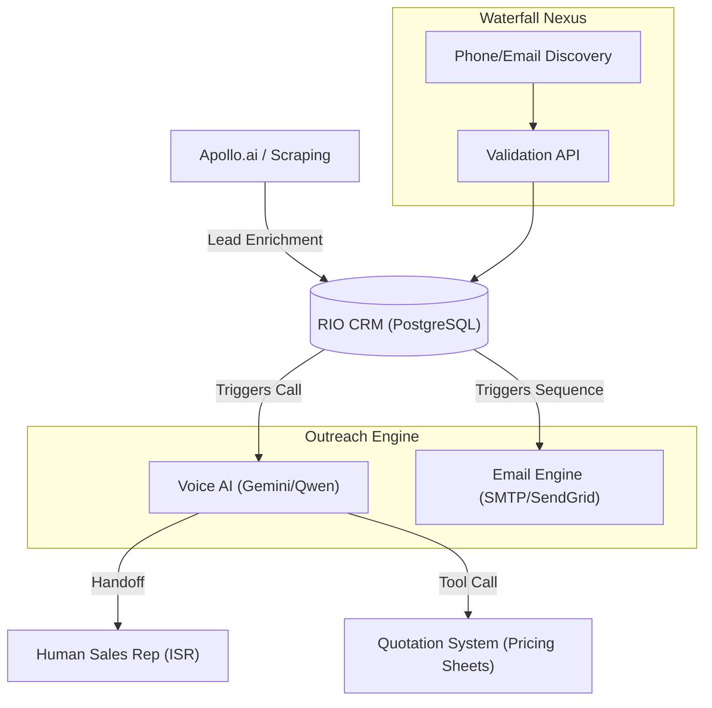

# Strategic Roadmap: AI-First Inside Sales Platform (RIO 1.0)

This document decodes the vision for a high-performance, automated sales engine and provides a technical blueprint for development.

---

## 1. Decoding the Vision ("The Business Translation")

The vision is to move from a **"Voice Assistant"** to an **"Autonomous Sales Operation."** Here is what the key terms mean in practice:

| Vision Term | Technical Meaning | Business Impact |
| :--- | :--- | :--- |
| **Orchestrate Outbound/Quotation** | AI doesn't just talk; it queries pricing tables, applies discounts, and generates actual PDF quotes. | Instant pricing for customers; no waiting for human math. |
| **ISR Handoff** | High-value leads are "warm transferred" from the AI to a human Inside Sales Rep (ISR). | AI handles the 90% "boring" qualification; Humans close the 10% "valuable" deals. |
| **Apollo.io Integration** | Automated lead sourcing. Apollo finds the email/phone; Rio makes the call. | Constant stream of new, fresh leads without manual searching. |
| **Multi-Channel Ingestion** | Support for both **API Feeds** (Apollo, Lusha) and **Manual Uploads** (Excel/CSV). | Flexibility to attack both cold markets (API) and warm lists (Events/Excel). |
| **Email Sequences** | If AI can't reach someone via phone, it automatically sends a personalized follow-up email. | Multi-channel outreach ensures the ball is never dropped. |
| **Waterfall Enrichment** | If Source A doesn't have a phone number, try Source B, then Source C, then Validate. | Highest possible data quality and reachability rates. |

---

## 2. Technical Architecture 2.0 (The Unified Experience)

We are moving to a hub-and-spoke model where the **FastAPI Backend** is the "Central Nervous System."

---

## 3. Development Roadmap: How to Build It

### Phase 1: The "Smart" Tool-Calling Expansion
- **Pricing Integration**: Connect your AI `check_inventory` tool to a dynamic pricing sheet (Excel/API).
- **Quotation Generator**: Create a tool that, when Rio says "I'll send you a quote," generates a PDF and adds it to the CRM.

### Phase 2: Live Handoff (The ISR Bridge)
- **Twilio Bridge**: Use the `<Dial>` or `<Conference>` verb in Twilio.
- **Protocol**: When a user says "I want to talk to a manager," Rio sends a signal to your Backend. The Backend puts the user on hold, calls the ISR, and bridges them.

### Phase 3: Lead Generation "The Waterfall Nexus"
- **Dual-Channel Ingestion**:
    1. **Automated**: Build a script that fetches leads from **Apollo.io API** based on target personas (e.g., "IT Managers in Chennai").
    2. **Manual**: Create a drag-and-drop UI to upload **Excel/CSV** files (e.g., from trade shows).
- **Enrichment Falls**:
    1. **Check Local DB**: Do we already know this person?
    2. **Apollo API**: If new, fetch details.
    3. **Lusha/ZoomInfo**: If Apollo misses phone, try secondary provider.
    4. **Validation**: Ping the number to ensure it's active before calling.

### Phase 4: Automated Sequences
- **Email Worker**: Use a background task (like Celery or APScheduler) to send emails.
- **Logic**: 
    - Day 1: AI Call. 
    - Day 1 (1 hour later): If No Answer, send "Sorry I wanted to talk to you something really important" email.
    - Day 3: Automated follow-up.

---

## 4. Key Performance Gains
- **Faster Quotes**: Reduced from hours to seconds.
- **Scale**: One ISR can now manage 500 leads instead of 50, because the AI "pre-qualifies" everyone.
- **Effortless Handoff**: The human rep gets a screen-pop with the AI transcript, so they know exactly what was discussed.
